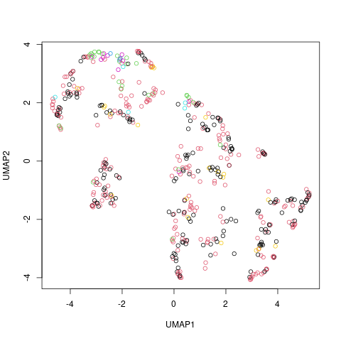

---
title: "Quick Start"
output: rmarkdown::html_vignette
vignette: >
  %\VignetteIndexEntry{Quick Start}
  %\VignetteEngine{knitr::rmarkdown}
  \usepackage[utf8]{inputenc}
---

# 

# The qeML Package: "Quick and Easy" Machine Learning

## <span style="color:blue"> "Easy for learners, powerful for advanced users"</span>

</br>
</br>
</br>

## Norm Matloff, UC Davis

I am a professor of computer science, and a former professor of
statistics, highly active in the areas of machine learning and
statistical computing, [bio](https://heather.cs.ucdavis.edu/matloff.html).

# What this package is about


* "Quick and Easy" ML

    * **MUCH SIMPLER USER INTERFACE** than caret, mlr3, tidymodels, etc.

    * easy for learners, powerful/convenient for experts

* <span style="color:purple">Ideal for teaching!</span>

    * numerous built-in real datasetss.

    * includes **tutorials** on major ML methods

* Special features for those experienced in  ML 

    * variety of functions for feature selection and model development

    * large variety of ML algorithms, including some novel/unusual ones

    * advanced plotting utilities

## Model fit

(Also see categorized function list, by calling
**vignette('FtnList')**.)

The letters 'qe' in the package title stand for "quick and easy,"
alluding to the convenience goal of the package.  We bring together a
variety of machine learning (ML) tools from standard R packages,
providing wrappers with a uniform, **extremely simple**  interface.
Hence the term "quick and easy."

For instance, consider the **mlb1** data included in the package,
consisting of data on professional baseball players.  As usual in R, we
load the data:

``` r
> data(mlb1)
```

Here is what the data looks like:

``` r
> head(mlb1)
        Position Height Weight   Age
1        Catcher     74    180 22.99
2        Catcher     74    215 34.69
3        Catcher     72    210 30.78
4  First_Baseman     72    210 35.43
5  First_Baseman     73    188 35.71
6 Second_Baseman     69    176 29.39
```

The qe-series function calls are of the vewry simple form

``` r
qe_function_name(dataset,variable_to_predict)
```

Say we wish to predict weight of a player.  For the random forests ML
algorithm, we would make the simple call

``` r
qeRF(mlb1,'Weight')
```

For gradient boosting, the call would be similar,

``` r
qeGBoost(mlb1,'Weight')
```

and so on.  **IT COULDN'T BE EASIER**!

Default values are used on the above calls, but nondefaults can be
specified, e.g.

``` r
qeRF(mlb1,'Weight',nTree=200)
```

## Prediction

Each qe-series function is paired with a **predict** method, e.g.
to predict player weight:

``` r
> z <- qeGBoost(mlb1,'Weight')
> predict(z,data.frame(Position='Catcher',Height=73,Age=28))
[1] 204.2406
```

A catcher of height 73 and age 28 would be predicted to have weight
about 204.

Categorical variables can be predicted too.  Where possible,
class probabilities are computed in addition to class.  Let's predict
player position from the physical characteristics:

``` r
> w <- qeGBoost(mlb1,'Position')
> predict(w,data.frame(Height=73,Weight=185,Age=28))
$predClasses
[1] "Relief_Pitcher"

$probs
        Catcher First_Baseman Outfielder Relief_Pitcher Second_Baseman
[1,] 0.02396515    0.03167778  0.2369061      0.2830575      0.1421796
     Shortstop Starting_Pitcher Third_Baseman
[1,] 0.0592867        0.1824601    0.04046717

```

A player of height 73, weight 185 and age 28
would be predicted to be a
relief pitcher, with probability 0.28.

## Holdout sets

By default, the qe functions reserve a *holdout set* on which to assess
accuracy.  The remaining data form the *training set*.

After a model is fit to the training set, we use it to predict the
holdout data.

``` r
> z <- qeRF(mlb1,'Weight')
holdout set has  101 rows
> z$testAcc
[1] 14.45285
> z$baseAcc
[1] 17.22356
```

The mean absolute prediction error (MAPE) on the holdout data was about
14.5 pounds.  On the other hand, if we had simply predicted every player
using the overall mean weight, the MAPE would be about 17.2.  So, using
height, age and player position for our prediction did improve things a
lot.

One can skip holdout by setting the **holdout** argument to NULL.

Of course, since the holdout set is random, the same is true for the
accuracy numbers.  To gauge the predictedive power of a model over many
holdout sets, one can use **replicMeans()**, which is
available in qeML by automatic loading of the **regtools**
package.  Say for 100 holdout sets:

``` r
> replicMeans(100,"qeRF(mlb1,'Weight')$testAcc")
[1] 13.6354
attr(,"stderr")
[1] 0.1147791
```

So the true MAPE for this model on new data is estimated to be 13.6.
The standard error is also output, to gauge whether 100 replicates is
enough.

# Tutorials

The package includes tutorials for those with no
background in machine learning, as well as tutorials on advanced
topics.  A few examples (showing how they are invoked):

* **vignette('ML_Overview')**; for those with no prior ML background

* **vignette('Overfitting')**; plugging "overfitting" into Google
  yielded 49,400,000 results!--but what is overfitting REALLY about?

* **vignette('Feature_Selection')**; we often need to pare down our set
  of predictor variables, both to save computation and prevent
  overfitting; how can this be done, especially in **qeML**?

* **vignette('PCA_and_UMAP')**; this vignette first takes a closer, more
  practical look at Principal Components Analysis, then gives an
  overview of UMAP, a relatively new nonlinear alternative to PCA
