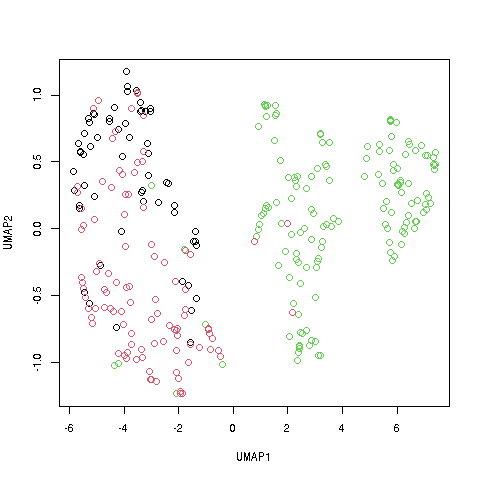

---
title: "Quick Start"
output: rmarkdown::html_vignette
vignette: >
  %\VignetteIndexEntry{Quick Start}
  %\VignetteEngine{knitr::rmarkdown}
  \usepackage[utf8]{inputenc}
---



# The qeML package: "Quick and easy" machine learning

### "Easy for learners, powerful for advanced users"

### Norm Matloff, UC Davis

I am a professor of computer science, and a former professor of
statistics, highly active in the areas of machine learning and
statistical computing, [bio](http://heather.cs.ucdavis.edu/matloff.html).

# What this package is about


* "Quick and Easy" ML

    * "Works right out of the box!"

    * MUCH SIMPLER USER INTERFACE than **tidymodels**, **caret**, **mlr3** etc.

    * easy for learners, powerful/convenient for experts

* Special Feature for ML Learners

    * includes a **tutorial** on major ML methods

* Special Features for Those Experienced in  ML 

    * variety of functions for feeature selection and model development

    * large variety of ML algorithms, including some novel/unusual ones

    * advanced plotting utilities, e.g. Double Descent

    * includes **tutorials** on special ML topics

## Overview

(Also see categorized function list, by calling
**vignette('FtnList')**.)

The letters 'qe' in the package title stand for "quick and easy,"
alluding to the convenience goal of the package.  We bring together a
variety of machine learning (ML) tools from standard R packages,
providing wrappers with a simple, uniform interface.  Hence the term
"quick and easy."

For instance, consider the **mlb1** data included in the package,
consisting of data on professional baseball players.  As usual in R, we
load the data:

``` r
> data(mlb1)
```

Say we wish to predict weight of a player.  For the random forests ML
algorithm, we would make the simple call

``` r
qeRF(mlb1,'Weight')
```

For gradient boosting, the call would be similar,

``` r
qeGBoost(mlb1,'Weight')
```

and so on.  IT COULDN'T BE EASIER!

Default values are used on the above calls, but nondefaults can be
specified, e.g.

``` r
qeRF(mlb1,'Weight',nTree=200)
```

## Prediction

Each qe-series function is paired with a **predict** method, e.g.
predict player weight:

``` r
> z <- qeGBoost(mlb1,'Weight')
> predict(z,data.frame(Position='Catcher',Height=73,Age=28))
[1] 204.2406
```

A catcher of height 73 and age 28 would be predicted to have weight
about 204.

Categorical variables can be predicted too.  Where possible,
class probabilities are computed in addition to class:

``` r
> w <- qeGBoost(mlb1,'Position')
> predict(w,data.frame(Height=73,Weight=185,Age=28))
$predClasses
[1] "Relief_Pitcher"

$probs
        Catcher First_Baseman Outfielder Relief_Pitcher Second_Baseman
[1,] 0.02396515    0.03167778  0.2369061      0.2830575      0.1421796
     Shortstop Starting_Pitcher Third_Baseman
[1,] 0.0592867        0.1824601    0.04046717

```

A player of height 73, weight 185 and age 28
would be predicted to be a
relief pitcher, with probability 0.28.

## Holdout sets

By default, the qe functions reserve a holdout set on which to assess
accuracy.  

``` r
> z <- qeRF(mlb1,'Weight')
holdout set has  101 rows
Loading required package: randomForest
randomForest 4.6-14
Type rfNews() to see new features/changes/bug fixes.
> z$testAcc
[1] 14.45285
> z$baseAcc
[1] 17.22356
```

The mean absolute prediction error on the holdout data was about 14.5
pounds.  

If one simply predicted every player using the overall mean weight, the
MAPE would be about 17.2.

One can skip holdout by setting the **holdout** argument to NULL.

Of course, since the holdout set is random, the same is true for the
accuracy numbers.  To gauge the predictedive power of a model over many
holdout sets, one can use **replicMeans()**, which is
available in qeML by automatic loading of the **regtools**
package.  Say for 100 holdout sets:

``` r
> replicMeans(100,"qeRF(mlb1,'Weight')$testAcc")
[1] 13.6354
attr(,"stderr")
[1] 0.1147791
```

So the true MAPE for this model on new data is estimated to be 13.6.
The standard error is also output, to gauge whether 100 replicates is
enough.

# Tutorials

The package includes an introductory tutorial for those with no
background in machine learning; simply call
**vignette('MLOverview')**.)

