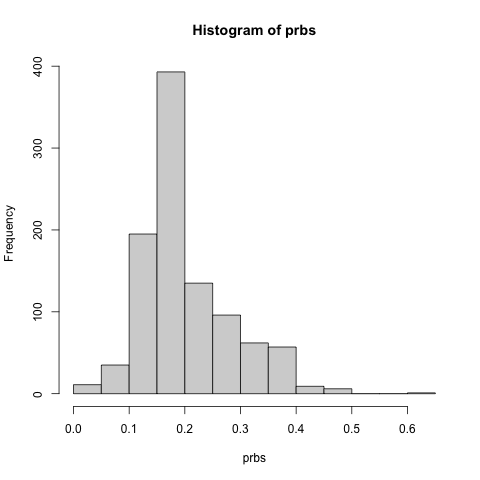

---
title: "Unbalanced Classes"
output:
   tufte::tufte_html: default
vignette: >
  %\VignetteIndexEntry{Unbalanced}
  %\VignetteEngine{knitr::rmarkdown}
  \usepackage[utf8]{inputenc}
---

```{r, include = FALSE}
knitr::opts_chunk$set(
  collapse = TRUE,
  comment = "#>"
)
```


#  Clearing the Confusion: A Closer Look at the Issue of Unbalanced Training Data 

Many resources on machine learning (ML) classification problems
recommend that if one's dataset has unbalanced class sizes, one should
modify the data to have equal class counts.  Yet it is explained here
that this is typically both unnecessary and possibly harmful.
Alternatives are presented.

# Outline

* The main concern regarding imbalanced training data: Our ML
  algorithm may never predict very small classes, making the algorithm
  rather meaningless, especially in 2-class settings.

* A popular solution is to artificially balance the data, e.g. via the CRAN
  package **smotefamily**.

* This changes the class probabilities, with possibly undesirable consequences.
Since class probabilities do factor into our prediction, changing them
distorts our analysis.

* Related problem: the class probabilities may be wrong to begin with,
  either due to the original sampling scheme or because the
probabilities may change.

* Two problems will be addressed in this document:

    - What can be done instead of artificially balancing the data?

    - What can we do to adjust data with the wrong class probabilities?

* Solutions:

    - Regarding imbalance, we first consider ROC approaches, but argue
      that simple, informal use of conditional probabilities is best.

    - Regarding incorrect class probabilities, we develop an adjustment
      formula.

## Introduction

Illustrations of the (perceived) problems and offered remedies appear in
numerous parts of the ML literature, ranging from Web tutorials to the
research literature.  Major packages, such as caret, parsnip and mlr3,
also offer remedies.

All of these sources recommend that you artificially equalize the class
counts in your data, via various resampling methods.  Say for instance
we are in the two-class case, and have class sizes of 20000 and 80000
for class 1 and class 0, respectively.  Here are some ways to rebalance.

* Randomly discard 60000 data points from class 0.

* Resample 80000 data points from the 20000, with replacement.

* Using distribution approximation methods such as SMOTE, resample 80000
  from the 20000.

Arguably, though, **this
is generally inadvisable, indeed harmful,** for several reasons:

* Undersampling is clearly problematic:  Why throw away data?
**Discarding data weakens our ability to predict new cases.**

* The data may be unbalanced *for a reason*.  Thus the imbalance itself
is useful information, again resulting in reduced predictive power if
it is ignored.

* There are **principled alternatives to
resampling,** including an adjustment formula to be presented here.  

In other words: 

> Resampling methods **are both harmful and unnecessay**.

## Motivating examples  

### Credit card fraud data

This is a Kaggle dataset.  Quoting from the Kaggle site,

> The datasets contains transactions made by credit cards in September
> 2013 by european cardholders. This dataset presents transactions that
> occurred in two days, where we have 492 frauds out of 284,807
> transactions. The dataset is highly unbalanced, the positive class
> (frauds) account for 0.172% of all transactions.

Note the phrase, "highly unbalanced."

### Missed appointments data

This is a Kaggle dataset on whether patients keep their medical
appointments.  The imbalance here is more mild, with about 20% of the
patients being no-shows.

### Optical letter recognition data

This is a well-known UCI Machine Learning Repository dataset.  Again
quoting from the site:

> The objective is to identify each of a large number of black-and-white
> rectangular pixel displays as one of the 26 capital letters in the
> English alphabet. The character images were based on 20 different fonts
> and each letter within these 20 fonts was randomly distorted to produce
> a file of 20,000 unique stimuli. Each stimulus was converted into 16
> primitive numerical attributes (statistical moments and edge counts)
> which were then scaled to fit into a range of integer values from 0
> through 15. 

This dataset is close to balanced, with each letter appearing about 775
times.

The dataset is conveniently available in the `mlbench` package.

### Mt. Sinai Hospital X-ray study

In an X-ray [classification
study](https://www.scientificamerican.com/article/rise-of-robot-radiologists)
from Mount Sinai Hospital, the classification method worked well on the
original hospital data, but not in prediction of new cases at other
locations.  The study's authors found that an important factor
underlying the discrepancy was that the class probabilities p<sub>i</sub>
vary from one hospital to another.  Here the class probabilities really
do change, not artificially, but the issues are the same, and again an
adjustment procedure would be desirable.

### Cell phone fraud

In 
[a study by Fawcett and
Provost](https://link.springer.com/article/10.1023/A:1009700419189),
the authors found that

> The level of fraud changes dramatically month-to-month because of
> modifications to work practices (both the carrier’s and the bandits’). 


## Terminology 

We refer to the class probabilities for given feature
values as *conditional class probabilities*, because they are
probabilities subject to conditions.  If say we wish to classify a
patient as to whether she has a certain disease or not, and we know her
blood test value on some measure is 2.39, the latter is the condition.
Among all patients with that blood test value, what proportion of them have
the disease?

The overall class probabilities are *unconditional class probabilities*.

The conditional and unconditional class probabilities are often referred
to as the *posterior* and *prior* probabilities.  This sounds Bayesian,
and Bayes' Rule, but there is no subjectivity involved;
these are real probabilities.  E.g. in a disease classification
application, there is a certain proportion of people in the population
who have the disease.  This is a prior probability, which we will
estimate from our training data.

## Notation

* c = number of classes
* Y = class label, 0,1,...,c-1
* X = vector of features
* p<sub>i</sub> = P(Y = i) (prior probs.)
* q<sub>i</sub>(t) = P(Y = i | X = t) (posterior probs.)
* Y<sub>pred</sub> = the value we predict for Y
* (X<sub>i</sub>,Y<sub>i</sub>), i=1,2,...,n: training data
* f<sub>i</sub>: (conditional) density of X within class i

* l<sub>ij</sub>: loss incurred by guessing class i when the true class is j

2-class case (Y = 0,1):

* p: P(Y = 1) (probability of class 1)

* r<sub>i</sub>: estimated q<sub>1</sub>(X<sub>i</sub>)    

## Key issue:  How were the data generated?

The examples above illustrate two important cases:

- The fraud data is *imbalanced*, but *naturally so*.  Assuming the
two-day data collection period was typical, the population class
probability for fraud will be about what we see in the data, 0.172%.

- The LetterRecognition data is *balanced*, but only *artificially so*.  The
curator of the dataset wanted the data to have about the same number
of instances of each letter.  But in general English usage, letters occur
with quite different frequencies:

>   E          12.02%
<br>
>   T           9.10%
<br>
>   A           8.12%
<br>
>   O           7.68%
<br>
>   I           7.31%
<br>
>   N           6.95%
<br>
...
<br>
...
<br>
>   Q           0.11
<br>
>   J           0.10
<br>
>   Z           0.07

One can obtain these numbers in the `regtools` package, included by
'qeML'.
:

``` r
> data(ltrfreqs)
> lf <- ltrfreqs
> lf <- ltrfreqs[,2] / 100
> names(lf) <- ltrfreqs[,1]
# example
> lf['A']
     A 
0.0812 
```

## What your ML algorithm is thinking

ML algorithms take your data literally.  Say you have a two-class
```{marginfigure}
The term *population* is sometimes only conceptual, but in all cases we
believe our data are generated randomly in some manner, and the term
refers to the associated distribution.
```
setting, for Classes 0 and 1.  If about 1/2 your data is Class 1, then
the algorithm, whether directly or indirectly, operates under the
assumption that the true population class probabilities are each about 0.5.

In the LetterRecognition data, since the sampling was actually *designed* to have
about the same number of instances for each letter, the algorithm you
use will then assume the true probabilities of the letters are about
1/26 each.  We know that is false, as the table shown earlier
illustrates.

So, if your sampling scheme artificially creates balanced data, as in
the LetterRecognition data, or if you do resampling to make your data
balanced, as is commonly recommended, you are fooling your ML algorithm.  

In the following, let's focus on the 2-class case for simplicity.

## Artificial balance will not achieve our goals

In fooling your algorithm, it will generate the wrong conditional
class-1 probabilities r<sub>i</sub> in our notation above.  And whether
we wish to minimize the overall probability of misclassification, or
expected loss, or any other criterion, the algorithm will (again,
directly or indirectly) rely on the values of r<sub>i</sub>.  

Consider the fraud example, in which the data are highly imbalanced but
in which wrongly guessing the large class carries heavy penalties for
us.  Recall our notation l<sub>01</sub> from above.  As noted, this may
be difficult to quantify, but for the moment, let's suppose we can do
so.  What are the implications in terms of artificially balancing the
data?

Actually, if we are going to be doing any adjustment of class sizes in
our data, we should make the fraud class *larger* than the non-fraud
class, not of equal size.  How much larger will depend on the value of
l<sub>01</sub>, but in any case, balancing the data will be wrong.

Frank Harrell 
[says it well](https://www.fharrell.com/post/classification/):

> For this reason the odd practice of subsampling the controls is used in
> an attempt to balance the frequencies and get some variation that will
> lead to sensible looking classifiers (users of regression models would
> never exclude good data to get an answer). Then they have to, in some
> ill-defined way, construct the classifier to make up for biasing the
> sample. It is simply the case that a classifier trained to a 1⁄2 [q =
> 1/2] prevalence situation will not be applicable to a population with a
> 1⁄1000 [p = 1/1000] prevalence. 

## So, what SHOULD be done?

We will focus here on the 2-class class.  Let r<sub>new</sub> denote the
estimated conditional class probability q<sub>new</sub> =
P(Y<sub>new</sub> = 1 | X<sub>new</sub>) 
for a new case to be classified.

Note that (a) as always, the r values are only sample estimates, subject
to sampling variability, and (b) not all qe-series functions are capable
of calculating the r values.

Clearly, one's course of action should center around the value of
```{marginfigure}
Both approaches will be informal.  The reader is urged to avoid
"automatic" solutions, as proper action is highly dependent on the
specific application.
```
r<sub>new</sub>.  Specifically, how should we use it?  We will discuss
two approaches:

1. Use of the ROC curve, which is derived from the
   r<sub>i</sub> values.

2. Direct consideration of the r<sub>new</sub> value.

### Approach 1: use the ROC curve

Here one considers various threshhold values h, where we guess class 1
if r<sub>new</sub> > h, 0 otherwise.  The value one chooses for h will
determine the True Positive Rate and False Positive Rate:

TPR(h) = P(Y<sub>pred</sub> = 1 | Y = 1) 
= &int;<sub>t > h</sub> f<sub>1</sub>(t) dt

FPR(h) = P(Y<sub>pred</sub> = 1 | Y = 0)
= &int;<sub>t > h</sub> f<sub>0</sub>(t) dt

The ROC curve is then a graph of TPR vs. FPR.  As we vary h, it traces
out the ROC curve.  Some R packages, such as ROCR, colorize the curve,
with the color showing the value of h.  The qeML function **qeROC**
(which wraps the **ROCR** package) does this.

For instance, let's look at the Missed Appointments Dataset.  Here are
the code and result:

``` r

> data(MissedAppts) 
> z <- qeXGBoost(MissedAppts,'No.show')
> qeROC(MissedAppts,z,'Yes')
```



Often a 45-degree line is superimposed on the ROC graph for comparison.
To see why, say we are classifying patients as having a certain disease
or not, say on the basis of a blood test.  For a value of h associated
with a point on the line, diseased and disease-free patients would have
the same probability of testing positive, indicating that the test has
no discriminatory value.  Thus, the further above the 45-line our ROC
curve is, the better our predictive power.

This can be used as an aid for the analyst to try to find a "happy
medium" point for deciding whether to take action on a suspicion that
the client will not show up. 

For instance, if we were to set h = 0.24, then FPR and TPR would be
about 0.2 and 0.4, respectively.   Is this an acceptable tradeoff?  The
answer depends on the severity of trouble that a missed appointment
brings the business and many other factors.  Taking all aspects of the
situation into account, the analyst can choose a value of h to use in
all future such decisions.

*A note on AUC:*  AUC is the total area under the ROC curve.  As such,
it is a measure of the general predictive ability of your algorithm on
this data.  This may seem attractive at first, but it is probably
irrelevant in most applications, as it places equal weight on all
possible TPR/FPR scenarios; usually we are far more interested in some 
settings than others.  Note too that AUC values for original data vs.
the artificially balanced data are not comparable.

### Approach 2:  informal, nonmechanical consideration of r (favored choice)

Here, our approach is even less mechanical, not even setting a fixed h
as above.  We simply look at r<sub>new</sub> **and special aspects of
this particular case** and use our judgment to decide.  Some cases may
have additional information not in our training set, thus justifying a
more flexible case-by-case approach.

Often the required decision is too critical to be left up to a machine.
For instance, relevant to our fraud example, in
[Fraud: a Guide to Its Prevention, Detection and Investigation](https://www.pwc.com.au/consulting/assets/risk-controls/fraud-control-jul08.pdf) 
by Price Waterhouse Coopers, it is pointed out that

> ... every fraud incident is different, and reactive responses will vary
> depending on the facts that are unique to each case.

Use of a machine learning algorithm to make a mechanical decision would
not provide this needed flexibility.

In the credit card fraud example, for instance, the (human) fraud
auditor would take  into account both that estimated probability as well
as such factors as the amount of the charge, special characteristics not
measured in the available features, and so on.  The auditor may not give
priority, for instance, to a case for which the probability is above h
but the monetary value of the transaction is small.  On the other hand,
if the probability is far above h, the auditor may give this transaction
a closer look even if the monetary value is small.

## Adjusting for incorrect/changed p<sub>i</sub>

As noted in the LetterRecognition data example, in some cases the data
are artificially balanced to begin with, due to the sampling design.  Or
we may have a situation like that of the Mt. Sinai Hospital radiology
data, in which the class probabilities may change from one site to
another, or may change over time as in the cell phone fraud example.
Thus, our estimated values of the p<sub>i</sub> will be wrong.  Can we
fix that?

### The adjustment formula

For simplicity, we'll assume the two-class setting here, with Class 0
and Class 1. This is the code for adjustment (the function is part of
the `regtools` package):

``` r
classadjust <- function (econdprobs, wrongprob1, trueprob1) 
{
    wrongratio <- (1 - wrongprob1)/wrongprob1
    fratios <- (1/econdprobs - 1) * (1/wrongratio)
    trueratios <- (1 - trueprob1)/trueprob1
    1/(1 + trueratios * fratios)
}

}

```

where 

- `condprobs` is the vector of conditional class probabilities r<sub>i</sub> for
  the dataset at hand, reported by the software applied to that data using
  incorrect p<sub>i</sub>

- `wrongratio` is the ratio of the numbers of Class 0 to Class 1
  datapoints in our dataset

- `trueratio` is the actual such ratio 

The return value is the set of adjusted conditional class
probabilities r<sub>i</sub>.

For instance, suppose we are in a setting in which there are equal
numbers of the two classes in our dataset, yet we know the true
(unconditional) class probabilities are 0.2 and 0.8 for Classes 0 and 1.
Then `wrongratio` would be 0.5/0.5 = 1.0, and `trueratio` would be
0.2/0.8 = 0.25. 


## Summary

- There's really no need to artificially balance your data, and doing so
  could be harmful.

- Please don't throw away data.

- Conversely, creating extra data by up-sampling distorts the analysis
  and may undermine our predictive power.

- If your data is "naturally" unbalanced, meaning it reflects population
  structure as in the credit card fraud example, don't artificially
force balance.  Instead, choose a threshhold for conditional
probabilities, and flag new cases that exceed it.

- If your data is unrealistically balanced, as in the LettersRecognition example,
  and the true unconditional class probabilities are known, use the
adjustment formula to convert the reported unconditional probabilities to
realistic ones, and classify using them.

- If your data is unrealistically balanced but the true unconditional
  class probabilities are unknown, recognize that your ML analysis may
have only a very restricted interpretation and value.

## Appendix A: derivation of the unequal-loss rule

Say the random variable W takes on the values 0,1, with P(W = 1) = r.
(In the above, W plays the role of Y, conditioned on X.)  Let's compute
the expected loss under two strategies:

* We guess W = 0.

Then our loss is 0 P(W = 0) + l<sub>01</sub> P(W = 1) = l<sub>01</sub>
r.

* We guess W = 1.

Then our loss is 1 P(W = 0) + 0 P(W = 1) = 1-r.

So our optimal stragegy is to guess W = 1 if and only if
1-r <  l<sub>01</sub> r.  In other words,

> Guess W = 1 if and only if r > 1/(1+l<sub>01</sub>).


  
## Appendix B: derivation of the adjustment formula

(For ease of notation etc., no distinction will be made here between
sample and population quantities.)

Say there are two classes, labeled 1 and 0.  Let Y denote the label and
X denote the features, and say we have a new case with X = t.  Then
the true equation is

P(Y = 1 | X = t) = p f<sub>1</sub>(t) / [p f<sub>1</sub>t) + (1-p)
f<sub>0</sub>(t)]  
<br>
(Eqn. 1)

where p is P(Y = 1), the true unconditional probability of Class 1, and
f<sub>i</sub>(t) is the conditional density of X within Class i.
(If X is a discete random variable, substitute a probability for f.)

Rewrite the above as

P(Y = 1 | X = t) = 1 / [1 + {(1-p)/p} f<sub>0</sub>(t) / f<sub>1</sub>(t)]
<br>
(Eqn. 2)

Now suppose the analyst artificially changes the class counts in the
data (or, as in the LetterRecognition example, the data is artificially
sampled by design), with proportions q and 1-q for the two classes.  In
the case of artificially equalizing the class proportions, we have q =
0.5.  Then the above becomes, in the eyes of your ML algorithm,

P(Y = 1 | X = t) = 1 / [1 + {(1-q)/q} f<sub>0</sub>(t) / f<sub>1</sub>(t)]
<br>
(Eqn. 3)

As noted earlier, what the ML algorithm is computing, directly or
indirectly, is P(Y = 1 | X = t).  Moreover, as also noted earlier, even
`caret` and `mlr3` do make these quantities available for the various t,
so we can solve for f<sub>0</sub>(t) / f<sub>1</sub>(t):

f<sub>0</sub>(t) / f<sub>1</sub>(t) = 
[g(t)-1] q/(1-q)
<br>
(Eqn. 4)

where

g(t) = 1 / P(Y = 1 | X = t)

Keep in mind that the g values are the ones output by our ML algorithm.
Setting t to the matrix of our feature values, we can plug t into Eqn. 4
to get the vector of f<sub>0/f<sub>1</sub></sub> values, and plug the
result into Eqn. 2 to obtain the vector of correct conditional
probabilities.

We can now substitute in (Eqn. 2) from (Eqn. 4) to get the proper
conditional probability.

The general m-class case. classes 0,1,...,m-1, actually reduces to the
2-class case, because 

P(Y = i | X = t)

can be viewed as the conditional probability of class i vs. all other
classes.  

For each j = 1,...,c, denote by q<sub>j</sub> and p<sub>j</sub>
the probabilities assumed by our ML algorithm, and the actual
probabilities, respecitvely.  For example, if the data are artificially
balanced, either by resampling or by the original sampling design, we
have q<sub>j</sub> = 1/c for all j.

To guide our intuition, note first that Eqn. 2 is now

P(Y = j | X = X<sub>i</sub>) =
1 / 
[1 + {(1-p<sub>j</sub>)/p<sub>j</sub>}
[&Sigma;<sub>m &ne; j</sub> f<sub>m</sub>(X<sub>i</sub>)] / f<sub>j</sub>(X<sub>i</sub>)
<br> 
Eqn. 5

Now to handle the multiclass case, for each j, j = 1,...,c and
each i = 1,...,n, do:

1.  Set g<sub>ij</sub> to the reciprocal of the outputted estimated value of
P(Y = j | X = X<sub>i</sub>), 

g<sub>ij</sub> = 1 / P(Y = j | X = X<sub>i</sub>), 

2.  Set

[&Sigma;<sub>m &ne; j</sub> f<sub>m</sub>(X<sub>i</sub>)] / f<sub>j</sub>(X<sub>i</sub>) =
[g<sub>ij</sub> - 1] q<sub>j</sub> / (1 - q<sub>j</sub>)
<br>
Eqn. 6

3.  Plug the result of Eqn. 6, along with the true p<sub>j</sub> ,into Eqn. 5
to obtain the true estimated conditional class probabilities.

## Appendix C:  What is really happening if you use equal class probabilities?

Say we have balanced data, so the q<sub>i</sub> = 1/m for each i.  Then
in predicting the class of a new case having X = t, Equation 1 becomes

P(Y = i | X = t) = f<sub>i</sub>(t) / 
[
&Sigma;<sub>j</sub> 
f<sub>j</sub>t) 
]

for i = 0,1,...,m-1, since all the 1/m factors cancel.

This shows that our guessed class is

j = arg max<sub>i</sub> f<sub>i</sub>(t)

In other words, you are in effect asking, "Within which class j would our
data X = t be most likely?"  That is, we are maximizing (say in the discrete
case)

P(X = t | Y = j)

over j. That's completely different from the question we really are
interested in, "Which class j is most likely, given X = t?", i.e.
maximizing

P(Y = j | X = t )
  
But it does show that if we artificially equalize the class sizes, we
are finding the Maximum Likelihood Estimate of j, **if the p<sub>i</sub>
are unknown.**

If we really don't know the true class probabilities p<sub>i</sub>, and
artificially equalize the class sizes, we are at least getting a kind of MLE.
However, what then is the practical meaning?  Unless you are a
subjective Bayesian (I am not), setting a flat prior, there is not much
here.


